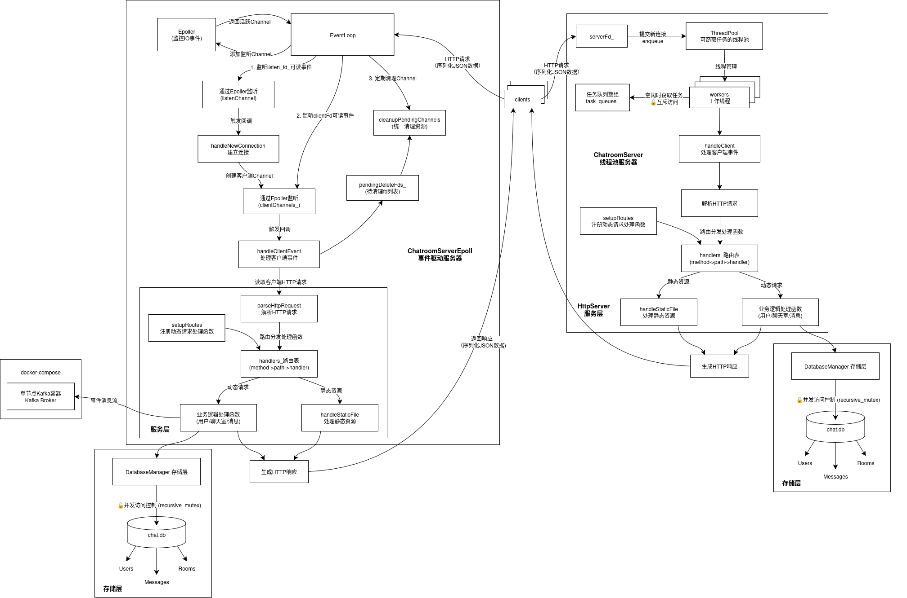
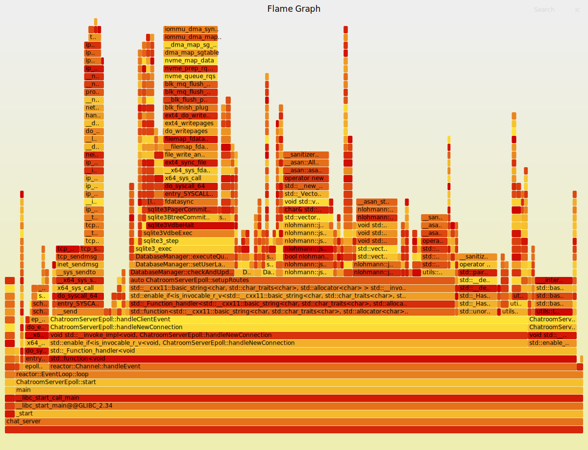

# ChatroomServer: 高性能事件驱动聊天室服务器
本项目是一个高性能服务器的练手项目，实现了两种不同架构的聊天室服务器，用 C++ 实现，支持多用户在线聊天、聊天室创建与加入、消息发送与接收等功能。有以下特点：
1. 事件驱动架构: 采用异步 IO 和事件回调机制，避免阻塞等待，提高并发处理能力。
2. 路由分发: 使用路由表将 HTTP 请求分发到对应的处理函数，支持多种请求类型。
3. 由 sqlite3 和 JSON 库源码集成，支持数据存储和解析，简化数据处理。
4. 通过 HTTP 协议提供 RESTful API 接口，支持多种客户端访问方式。
5. 在用户登录、创建房间、发送消息等操作时以 JSON 异步写入 Kafka topic，便于分析和监控用户行为。

## 1. 基本原理
目前项目暂时基于 epoll/reactor 模型实现，主要组件包括 EventLoop、Channel 和 Epoller 等。Epoller 是对 epoll 的封装，负责管理文件描述符 fd 和其感兴趣的事件 event 的映射关系。Channel 将 fd 与其感兴趣的事件（读、写、关闭）、对应的回调处理函数绑定。

EventLoop 事件循环内部持有一个 Epoller 和多个 Channel。 EventLoop 的 loop() 方法调用 Epoller 的 wait() 方法等待事件发生。当有事件发生时 Epoller 返回活跃事件列表，EventLoop 遍历这些事件，根据 fd 找到对应的 Channel，调用 Channel 的 handleEvent() 方法处理事件。

本项目还集成了 Kafka 事件流，目前采用 Docker 单节点部署 Kafka，方便本地开发和练手，具体配置参考 docker-compose.yml。并且项目中的 sqlite3, nlohmann/json, librdkafka 等第三方库都已源码集成到项目中，简化了依赖管理。

## 2. 项目架构


### 2.1 基于线程池的经典服务器架构
- **核心思想**: 在指定端口轮询阻塞监听客户端连接，将每个客户端请求分配到线程池中的一个工作线程，并且在工作线程空闲时可以窃取其他线程的任务队列，避免资源浪费。
- **主要组件**: 可以分为两层架构理解：服务层(HttpServer + ThreadPool) + 存储层(DatabaseManager)
- **请求流程**:
  1. 主线程接受连接
  2. 将请求处理任务提交到线程池
  3. 工作线程执行完整的请求处理流程
  4. 响应返回给客户端后关闭连接
- **特点**: 实现简单直观，适合中小规模并发，其中线程管理环节是导致性能瓶颈的主要原因。

### 2.2 基于 epoll/reactor 模型的高性能服务器架构
- **核心思想**: 在单线程中通过非阻塞事件触发 IO 和回调函数来处理客户端请求，避免线程切换和锁竞争带来的性能损耗。
- **主要组件**: 可以分为三层架构理解：服务层(ChatroomServerEpoll) + 事件层(EventLoop + Epoller + Channel) + 存储层(DatabaseManager)
- **请求流程**:
  1. 创建监听 socket 并绑定端口，将监听 socket 的 channel 注册到 epoller 中
  2. 进入主线程事件循环 EventLoop，等待并处理事件
  3. 事件发生时触发 channel 对应的回调函数，处理客户端请求
  4. 处理完请求后关闭连接，避免长时间占用资源（短链接），延迟统一清理已废弃的 Channel
- **特点**: 通过事件驱动和非阻塞 IO 实现高并发处理，减少了线程切换和锁竞争。在服务层负责 HTTP 请求的解析和路由分发，提供 RESTful API 接口，支持多种客户端访问方式。接下来可以进一步优化为多线程事件循环模型，减少数据层读写性能瓶颈。

## 3. Kafka 事件流集成
本项目集成了 Kafka 作为事件流和消息队列中间件。每当用户登录、发送消息、创建房间等操作时，服务器会将相关事件以 JSON 格式写入 Kafka topic（如 `chatroom_events`）。可以实现：
- 用户行为和聊天室事件的异步记录
- 支持实时数据分析、监控和审计
- 便于与其他系统（如消息推送、统计分析）集成。

## 3. wrk 压力测试
1. 使用 Lua 脚本定义请求参数和处理逻辑
    ```lua
    wrk.method = "POST"
    wrk.headers["Content-Type"] = "application/json"
    wrk.body = '{"username":"testuser","password":"testpass"}'
    ```
2. 使用 wrk 工具进行压力测试
    ```sh
    wrk -t16 -c100 -d10s -s post_login.lua http://localhost:8080/login
    ```
3. 性能对比
   - 测试环境
     - **CPU**: 13th Gen Intel Core i5-13500H (12核心/16线程, 最高4.7GHz)
     - **内存**: 16GB DDR5 6400MHz
     - **存储**: KINGSTON SNV2S500G 500GB NVMe SSD
     - **GPU**: NVIDIA GeForce RTX 3050 4GB + Intel Iris Xe Graphics

    - 基于线程池的服务器测试结果
    ```
    Running 10s test @ http://localhost:8080/login
      16 threads and 100 connections
      Thread Stats   Avg      Stdev     Max   +/- Stdev
        Latency    14.31ms   40.90ms 843.30ms   97.28%
        Req/Sec   452.74    209.75     1.59k    70.05%
      70279 requests in 10.01s, 16.55MB read
      Socket errors: connect 0, read 70275, write 0, timeout 0
      Non-2xx or 3xx responses: 70279
    Requests/sec:   7023.23
    Transfer/sec:      1.65MB
    ```

    - 基于 epoll/reactor 的高性能服务器测试结果
    ```
    Running 10s test @ http://localhost:8080/login
      16 threads and 100 connections
      Thread Stats   Avg      Stdev     Max   +/- Stdev
        Latency    13.00ms    3.84ms  57.86ms   90.97%
        Req/Sec   466.65     71.89   600.00     65.06%
      74371 requests in 10.01s, 9.22MB read
    Requests/sec:   7429.13
    Transfer/sec:      0.92MB
    ```

4. 总结

    | 性能指标 | 线程池架构 | 事件驱动架构 | 改进值 | 改进比例 |
    |---------|-----------|-------------|-------|---------|
    | 平均延迟 | 14.31ms | 13.00ms | -1.31ms | -9.15% |
    | 延迟标准差 | 40.90ms | 3.84ms | -37.06ms | -90.61% |
    | 最大延迟 | 843.30ms | 57.86ms | -785.44ms | -93.14% |
    | 每秒请求数 | 7023.23 | 7429.13 | +405.9 | +5.78% |
    | 总请求数 (10秒) | 70279 | 74371 | +4092 | +5.82% |
    | 传输速率 | 1.65MB/s | 0.92MB/s | -0.73MB/s | -44.24% |

    - 整体看来，事件驱动架构在高并发场景下更加稳定，因为避免了线程切换和锁竞争带来的性能损耗。

---

## AddressSanitizer (ASan) 检测
由于 EventLoop 访问已释放的 Channel 对象导致 use-after-free 内存错误，项目代码已优化为在 EventLoop 中延迟统一释放 Channel。下面是定位和修复内存错误的过程：
1. CMakeLists.txt 中启用 AddressSanitizer
    ```cmake
    set(CMAKE_CXX_FLAGS "${CMAKE_CXX_FLAGS} -fsanitize=address -g")
    ```
2. 编译后运行时，ASan 会自动检测内存错误并报告
    ```sh
    ==2493372==ERROR: AddressSanitizer: heap-use-after-free on address 0x50e0000003d8
        #0  reactor::Channel::handleEvent() .../channel.cpp:25
        #1  reactor::EventLoop::loop() .../event_loop.cpp:24
        ...
        freed by thread T0 here:
        #0  operator delete(void*, unsigned long) ...
        #1  ... ChatroomServerEpoll::handleClientEvent(int) ...

    ```
    - EventLoop 访问已释放的 Channel 对象，导致 use-after-free。
      - 原代码释放 channel： chatroom_server_epoll.cpp
        ```cpp
        ...(channel 新客户端连接处理回调函数)...
        eventLoop_->removeChannel(clientFd);
        clientChannels_.erase(fd);
        close(fd);
        ```
    - 解决方法：
      1. 在处理回调函数先暂存待删除的客户端链接 pendingDeleteFds
        ```cpp
        ...
        pendingDeleteFds_.push_back(clientFd);
        ...
        ```
      2. 在 EventLoop 的 loop() 方法中统一清理已废弃的 Channel
        ```cpp
        void ChatroomServerEpoll::cleanupPendingChannels() {
        for (int fd : pendingDeleteFds_) {
            clientChannels_.erase(fd);
            close(fd);
        }
        pendingDeleteFds_.clear();
        }

        Event::loop() {
            ...

            if (chatroomServerEpoll_) {
            chatroomServerEpoll_->cleanupPendingChannels();
            }
        }
        ```
## 下一步计划
- 优化为多线程事件循环模型，减少数据层读写性能瓶颈

    

--- 

你已经成功实现了 Kafka 事件流集成和消费，下面是梳理后的简明笔记，便于后续查阅和新手参考：

---

## Kafka 事件流集成与测试流程

1. 启动 Kafka 服务

    ```sh
    docker-compose up -d
    ```

2. 编译并运行聊天室服务器

    ```sh
    mkdir build && cd build
    cmake ..
    make install -j$(nproc)
    cd bin && ./chat_server
    ```

3. Kafka 事件消息测试

   - **查看 topic 列表**
     ```sh
     docker exec -it kafka bash
     kafka-topics --bootstrap-server kafka:9092 --list
     ```

   - **删除 topic（清空所有消息）**
     ```sh
     docker exec -it kafka bash
     kafka-topics --bootstrap-server kafka:9092 --delete --topic chatroom_events
     ```

   - **消费消息（查看所有历史事件）**
     ```sh
     docker exec -it kafka bash
     kafka-console-consumer --bootstrap-server localhost:9092 --topic chatroom_events --partition 0 --from-beginning
     ```

   - **查看消息数量（offset）**
     ```sh
     docker exec -it kafka bash
     kafka-run-class kafka.tools.GetOffsetShell --broker-list kafka:9092 --topic chatroom_events --time -1
     ```

4. 关闭 Kafka 服务

    ```sh
    docker-compose down
    ```
5. 测试结果
    ```
    [appuser@7a418eec3c66 ~]$ kafka-console-consumer --bootstrap-server localhost:9092 --topic chatroom_events --partition 0 --from-beginning
    {"action":"login","timestamp":1753432281839,"type":"user_event","username":"haha"}
    {"content":"123","room":"123","timestamp":1753432298432,"type":"chat_message","username":"haha"}
    {"content":"123","room":"123","timestamp":1753432299096,"type":"chat_message","username":"haha"}
    {"content":"123","room":"123","timestamp":1753432299751,"type":"chat_message","username":"haha"}
    ```

