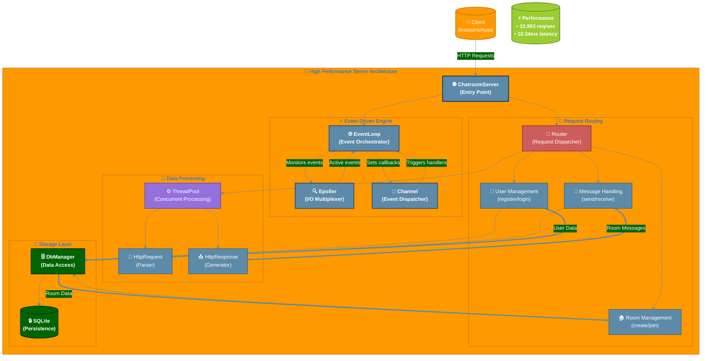

```mermaid
%%{init: {
  'theme': 'base',
  'themeVariables': {
    'primaryColor': '#5D8AA8',
    'primaryTextColor': '#fff',
    'primaryBorderColor': '#1F456E',
    'lineColor': '#5D8AA8',
    'secondaryColor': '#006400',
    'tertiaryColor': '#ff9900'
  }
}}%%

flowchart TD
    classDef coreComponent fill:#5D8AA8,stroke:#1F456E,stroke-width:2px,color:white,font-weight:bold
    classDef dataLayer fill:#006400,stroke:#003200,stroke-width:2px,color:white,font-weight:bold
    classDef clientComponent fill:#ff9900,stroke:#cc7a00,stroke-width:2px
    classDef eventFlow fill:#9370DB,stroke:#7248B8,stroke-width:2px,color:white
    classDef routingComponent fill:#CD5C5C,stroke:#8B3A3A,stroke-width:2px,color:white
    
    Client[("👥 Client\n Browsers/Apps")]:::clientComponent
    Client --> |"HTTP Requests"| WebServer
    
    subgraph "🚀 High Performance Server Architecture"
        WebServer["🌐 ChatroomServer\n(Entry Point)"]
        
        subgraph "⚡ Event-Driven Engine"
            direction TB
            EventLoop["⚙️ EventLoop\n(Event Orchestrator)"]:::coreComponent
            Epoller["🔍 Epoller\n(I/O Multiplexer)"]:::coreComponent
            Channel["🔌 Channel\n(Event Dispatcher)"]:::coreComponent
            
            EventLoop --> |"Monitors events"| Epoller
            Epoller --> |"Active events"| EventLoop
            EventLoop --> |"Sets callbacks"| Channel
            Channel --> |"Triggers handlers"| EventLoop
        end
        
        subgraph "🔀 Request Routing"
            direction TB
            Router["🧭 Router\n(Request Dispatcher)"]:::routingComponent
            
            UserHandler["👤 User Management\n(register/login)"]
            RoomHandler["🏠 Room Management\n(create/join)"]
            MessageHandler["💬 Message Handling\n(send/receive)"]
            
            Router --> UserHandler
            Router --> RoomHandler
            Router --> MessageHandler
        end
        
        subgraph "🔄 Data Processing"
            direction TB
            ThreadPool["⚙️ ThreadPool\n(Concurrent Processing)"]:::eventFlow
            
            HttpRequest["📝 HttpRequest\n(Parser)"]
            HttpResponse["📤 HttpResponse\n(Generator)"]
            
            ThreadPool --> HttpRequest
            ThreadPool --> HttpResponse
        end
        
        subgraph "💾 Storage Layer"
            direction TB
            DbManager["🗄️ DbManager\n(Data Access)"]:::dataLayer
            SQLite[("🔒 SQLite\n(Persistence)")]:::dataLayer
            
            DbManager --> SQLite
        end
        
        WebServer --> EventLoop
        WebServer --> Router
        Router --> ThreadPool
        
        UserHandler --> DbManager
        RoomHandler --> DbManager
        MessageHandler --> DbManager
    end

    %% Data Flow Annotations
    MessageHandler ==> |"Room Messages"| HttpResponse
    DbManager ==> |"User Data"| UserHandler
    DbManager ==> |"Room Data"| RoomHandler
    
    %% Performance Features
    style WebServer fill:#5D8AA8,stroke:#1F456E,stroke-width:3px,color:white,font-weight:bold
    
    %% Performance Metrics
    performanceBox[("⚡ Performance\n• 10,993 req/sec\n• 10.34ms latency")]
    style performanceBox fill:#9ACD32,stroke:#6B8E23,stroke-width:2px,font-weight:bold
```